# PullPal AI Agent - Code Flow Diagram

## 📋 Table of Contents
- [High-Level Architecture](#high-level-architecture)
- [Detailed Component Flow](#detailed-component-flow)
- [Agent Pipeline](#agent-pipeline)
- [Data Flow](#data-flow)
- [Class Hierarchy](#class-hierarchy)
- [External Dependencies](#external-dependencies)

---

## 🏗️ High-Level Architecture

```mermaid
graph TB
    User[👤 User] -->|Enters PR URL| UI[🖥️ Streamlit UI]
    UI -->|Invokes| Workflow[🔄 LangGraph Workflow]
    Workflow -->|Sequential Execution| Agents[🤖 Agent Pipeline]
    Agents -->|Results| UI
    UI -->|Displays| Results[📊 Formatted Results]
    
    style UI fill:#e1f5ff
    style Workflow fill:#fff4e6
    style Agents fill:#f3e5f5
```



---

## 🔍 Detailed Component Flow

```mermaid
graph LR
    subgraph "Entry Points"
        UI[ui.py<br/>Streamlit Interface]
        CLI[agent_orchestration.py<br/>CLI Entry]
    end
    
    subgraph "Orchestration Layer"
        Workflow[LangGraph Workflow<br/>StateGraph]
    end
    
    subgraph "Agent Layer"
        A1[PR Fetcher<br/>Agent]
        A2[Code Review<br/>Agent]
        A3[Test Coverage<br/>Agent]
        A4[Doc Summarizer<br/>Agent]
    end
    
    subgraph "Integration Layer"
        GH[github_fetcher.py<br/>GitHub API Client]
        LLM[llm_client.py<br/>LLM Adapter]
    end
    
    subgraph "External Services"
        GitHub[🐙 GitHub API]
        AI[🤖 LLM Service<br/>OpenAI/Gemini]
    end
    
    UI --> Workflow
    CLI --> Workflow
    Workflow --> A1
    A1 --> A2
    A2 --> A3
    A3 --> A4
    
    A1 --> GH
    A2 --> LLM
    A3 --> LLM
    A4 --> LLM
    
    GH --> GitHub
    LLM --> AI
    
    style UI fill:#4fc3f7
    style CLI fill:#4fc3f7
    style Workflow fill:#ffb74d
    style A1 fill:#ba68c8
    style A2 fill:#ba68c8
    style A3 fill:#ba68c8
    style A4 fill:#ba68c8
    style GH fill:#81c784
    style LLM fill:#81c784
```



---

## 🔄 Agent Pipeline


---

## 📊 Data Flow

```mermaid
graph TD
    Start([Start]) --> Input[User Input:<br/>PR URL + Token]
    Input --> State1[PRFetcherAgentState]
    
    State1 --> Fetch[PR Fetcher Agent]
    Fetch --> State2[Enhanced State:<br/>+ owner, repo, pr_number<br/>+ files[]<br/>+ repo_context{}]
    
    State2 --> Review[Code Review Agent]
    Review --> State3[CodeReviewAgentState:<br/>+ findings[]<br/>- type, message, suggestion<br/>- line_start, line_end<br/>- code_snippet]
    
    State3 --> Coverage[Test Coverage Agent]
    Coverage --> State4[TestCoverageAgentState:<br/>+ coverage_findings[]<br/>- filename, issue<br/>- generated_tests[]]
    
    State4 --> Summary[Doc Summarizer Agent]
    Summary --> State5[PRSummaryAgentState:<br/>+ pr_summary]
    
    State5 --> Display[Display in UI]
    Display --> End([End])
    
    style Start fill:#4caf50
    style End fill:#f44336
    style State1 fill:#e3f2fd
    style State2 fill:#e3f2fd
    style State3 fill:#fff3e0
    style State4 fill:#fce4ec
    style State5 fill:#f3e5f5
```

---

## 🏛️ Class Hierarchy


---

## 🔧 Component Details

### 1️⃣ PR Fetcher Agent (`pr_fetcher_agent.py`)
**Purpose**: Fetch PR files and repository context


**Key Functions**:
- `parse_github_pr_url()`: Extract owner, repo, PR number
- `fetch_pr_files()`: Get changed files with retry/backoff
- `fetch_repo_context()`: Get README, languages, dependencies, structure
- `parse_pr_files()`: Normalize file data

---

### 2️⃣ Code Review Agent (`code_review_agent.py`)
**Purpose**: Analyze code changes for issues


**Key Functions**:
- `get_file_language()`: Map extension to language
- `extract_code_context()`: Parse diff for line numbers
- `group_code_by_context()`: Group related code sections
- `safe_parse_json()`: Robust JSON parsing

**Language Support**: Python, Java, JavaScript, TypeScript, Go, Ruby, PHP, C#, Kotlin, Rust, Swift, Scala, C++, C

---

### 3️⃣ Test Coverage Agent (`test_coverage_agent.py`)
**Purpose**: Detect missing tests and generate stubs


**Key Functions**:
- `get_language_config()`: Get test framework & patterns
- `extract_added_functions()`: Find new code using regex

**Supported Test Frameworks**: pytest, JUnit 5, Jest, RSpec, PHPUnit, xUnit, Go testing, Rust tests, etc.

---

### 4️⃣ Doc Summarizer Agent (`doc_summarizer_agent.py`)
**Purpose**: Generate natural language PR summary


---

### 🌐 GitHub Fetcher (`github_fetcher.py`)
**Features**:
- ✅ Rate limit handling with auto-retry
- ✅ Exponential backoff for errors
- ✅ Support for private repos with token
- ✅ Repository context fetching (README, languages, dependencies, structure)
- ✅ Pagination for large PRs

---

### 🤖 LLM Client (`llm_client.py`)
**Features**:
- ✅ Dual-mode: OpenAI-compatible API or Google Gemini
- ✅ Routes based on `HOST_URL` environment variable
- ✅ Unified interface for both backends
- ✅ Graceful error handling

**Decision Logic**:
```
IF HOST_URL is set:
    Use OpenAI SDK with custom base_url
ELSE:
    Use langchain_google_genai.ChatGoogleGenerativeAI
```

---

## 🎨 Streamlit UI Flow


---

## 🔐 Environment Configuration


---

## 📦 External Dependencies


---

## 🎯 Error Handling Strategy


---

## 📝 Key Design Patterns

### 1. **State Inheritance Chain**
```
PRFetcherAgentState
    ↓ (inherits)
CodeReviewAgentState
    ↓ (inherits)
TestCoverageAgentState
    ↓ (inherits)
PRSummaryAgentState
```
Each agent adds its own fields while maintaining access to all previous data.

### 2. **Adapter Pattern (LLM Client)**
Single interface abstracts multiple LLM backends (OpenAI, Gemini).

### 3. **Pipeline Pattern (LangGraph)**
Sequential execution with state passing between agents.

### 4. **Strategy Pattern (Language Detection)**
Different behavior based on file type detection.

---

## 🚀 Execution Flow Summary

1. **User Input**: Enters PR URL in Streamlit UI
2. **Initialization**: Create initial state with PR URL
3. **PR Fetcher**: Fetch files and repo context from GitHub
4. **Code Review**: Analyze each file with LLM, detect issues
5. **Test Coverage**: Check for missing tests, generate stubs
6. **Summarize**: Create natural language summary
7. **Display**: Render formatted results in UI

---

## 📊 Performance Characteristics

| Component | Bottleneck | Mitigation |
|-----------|-----------|-----------|
| GitHub API | Rate limits (60/hr) | Token auth (5000/hr), auto-retry |
| LLM Calls | Response time | Parallel where possible, streaming |
| Large PRs | Many files | Pagination, selective analysis |
| JSON Parsing | Malformed output | Regex extraction, fallbacks |

---

## 🔮 Future Enhancements (Potential)


---

## 📖 References

- **LangGraph Documentation**: https://langchain-ai.github.io/langgraph/
- **GitHub REST API**: https://docs.github.com/en/rest
- **OpenAI API**: https://platform.openai.com/docs/api-reference
- **Streamlit Docs**: https://docs.streamlit.io/

---

*Generated: 2025-11-08*  
*Project: PullPal AI Agent*  
*Version: 1.0*
